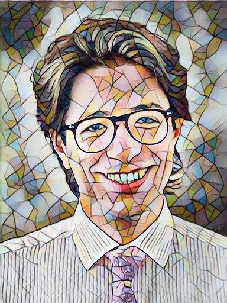
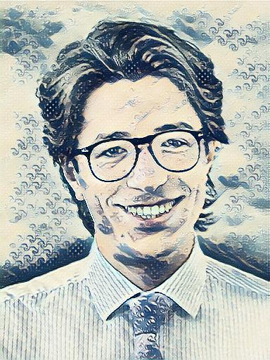

# CSCI 1290 Final Project: Neural Style

|       James Tompkin (Mosaic Style)        |   James Tompkin (Great Wave Style)    |
| :---------------------------------------: | :-----------------------------------: |
|  |  |

For our final project, we implemented style transfer based on [Perceptual Losses for Real-Time Style Transfer
and Super-Resolution](https://cs.stanford.edu/people/jcjohns/eccv16/) by Justin Johnson, Alexandre Alahi and Fei-Fei Li and the [fast-neural-style-pytorch](https://github.com/rrmina/fast-neural-style-pytorch) repository.

## Running the Code

All of the scripts can be found in `source/script_modules`. To run a script, `cd` into the project root directory and run it as a Python module. For example:

```
python3 -m source.script_modules.train_model --file_name <settings.json>
```

Several settings files can be found in the `settings` folder.

## Project Setup

### Creating a Virtual Environment

To create a virtual environment, run `python3 -m venv venv`. Then, do `source venv/bin/activate` (or equivalent) and `pip3 install -r requirements.txt` to install the project's dependencies.

## Acknowledgements

### Style Images

- The style `action.jpg` is from Pinterest user [Gene Miller](https://www.pinterest.com/vilstef01/_saved/). It can be found [here](https://i.pinimg.com/originals/07/d9/60/07d960c5db5d25176b379ee615fd624e.jpg).
- The styles `mosaic.jpg` and `udnie.jpg` are from the [fast-neural-style-pytorch](https://github.com/rrmina/fast-neural-style-pytorch) repository.
- The style `elbe.jpg` is a painting of Dresden by Bernardo Bellotto.
- The style `cafe.jpg` is Café Terrace at Night by Vincent Van Gogh.
- The style `wave.jpg` is The Great Wave off Kanagawa by Katsushika Hokusai.
- The style `stairs.jpg` is Nude Descending a Staircase, No. 2 by Marcel Duchamp.
- The style `haring.jpg` is Retrospect by Keith Haring.
- The style `sitter.jpg` is Juan Legua by Juan Gris.
